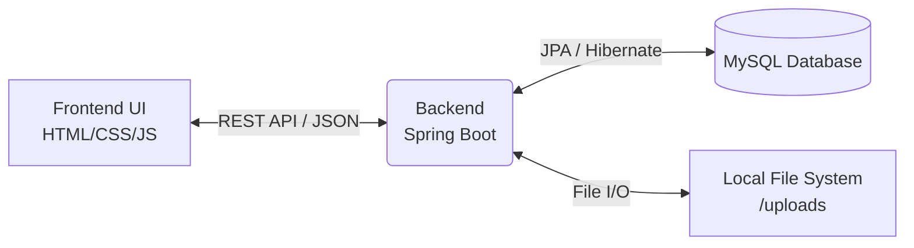

<div align="center">
  
# 🔒 Secure File Sharing System

**A robust, session-based file sharing platform designed for secure uploading, managing, and sharing of confidential files.**


</div>

---

## 📖 Table of Contents
- [About the Project](#-about-the-project)
- [Key Features](#-key-features)
- [System Architecture](#-system-architecture)
- [Project Structure](#-project-structure)
- [The Team](#-the-team)
- [Setup & Installation](#-setup--installation-guide)
- [Git Workflow](#-git-workflow-critical)
- [Future Enhancements](#-future-enhancements)

---

## 🚀 About the Project
The **Secure File Sharing System** bridges the gap between usability and strict data security. It allows users to register, upload sensitive documents, and selectively share them through unique, password-protected, and time-expiring links. The integration of "Self-Destruct" links ensures that highly classified files can only be downloaded once before being permanently erased.

## ✨ Key Features
- **🛡️ Secure Authentication:** Robust session-based user registration and login.
- **📁 File Management:** Seamlessly upload, view, and manage your documents via an intuitive dashboard.
- **🔗 Shareable Links:** Generate unique cryptographic URLs for sharing files externally.
- **🔐 Password Protection:** Lock individual files behind custom passwords.
- **⏳ Expiration Timers:** Set strict time-to-live (TTL) limits on shared links.
- **🔥 Self-Destruct Mode:** Ensure absolute privacy with links that permanently delete the file after a single download.

---

## 🏗 System Architecture



## 📂 Project Structure

```text
secure-file-sharing-system/
├── backend/                  # Spring Boot Java Application
│   ├── src/main/java/        # Business logic, Controllers, Services, Repositories
│   ├── src/main/resources/   # application.properties
│   └── pom.xml               # Maven dependencies
├── frontend/                 # Static Web Assets
│   ├── css/                  # Stylesheets
│   ├── js/                   # Vanilla JavaScript logic
│   ├── views/                # Modular UI components
│   ├── index.html            # Main Entry / Dashboard
│   ├── login.html            # Authentication UI
│   └── register.html         # User Sign-up UI
├── uploads/                  # Local directory for stored files
├── setup_database.sql        # Database schema initialization script
└── README.md                 # Project Documentation
```

---

## 👥 The Team
| Role | Name | Responsibilities |
| :--- | :--- | :--- |
| **Project Manager** | Hamza Badshah | Overseeing development lifecycle, code reviews, and Git flow. |
| **Backend Developers** | Hammad Tahir, Hamza Badshah | Spring Boot architecture, REST APIs, Security, Business Logic. |
| **Frontend Developers** | Aman Sajid, Hafsa Khan | UI/UX design, DOM manipulation, API integration. |
| **Database Designer** | Esha Chatta | Schema design, Entity relations, Query optimization. |

---

## 💻 Setup & Installation Guide

### 1. Database Setup (Esha's Rules)
The system uses MySQL for data persistence.

1. **Install MySQL:** Ensure MySQL Server is running on your machine.
2. **Execute Setup Script:** Run the provided `setup_database.sql` script.
   ```sql
   -- This handles the creation of secure_file_db and all necessary tables.
   SOURCE /path/to/setup_database.sql;
   ```
3. **Configure Credentials:** Open `backend/src/main/resources/application.properties` and update your database credentials:
   ```properties
   spring.datasource.url=jdbc:mysql://localhost:3306/secure_file_db
   spring.datasource.username=root
   spring.datasource.password=your_password
   ```

### 2. Backend Setup
1. Open the `backend` folder in your IDE (VS Code, IntelliJ, etc.).
2. Ensure **Java 21** is installed.
3. Allow Maven to download all dependencies automatically.
4. Run `SecurefileApplication.java`.
5. The REST API will be available at `http://localhost:8080`.

### 3. Frontend Setup
1. Open the `frontend` folder in VS Code.
2. Install the **Live Server** extension.
3. Right-click on `login.html` (or `index.html`) and select **"Open with Live Server"**.
4. The application will launch in your browser without CORS interference.

---

## 🛑 Git Workflow (CRITICAL)
To maintain a stable `main` branch, all team members must follow this workflow:

1. **Pull Latest Changes:** `git checkout main` -> `git pull origin main`
2. **Create Feature Branch:** `git checkout -b feature/your-feature-name`
3. **Commit Your Work:** `git add .` -> `git commit -m "feat: descriptive message"`
4. **Push to Remote:** `git push origin feature/your-feature-name`
5. **Pull Request:** Open a PR on GitHub and assign **Hamza Badshah** as the reviewer. **DO NOT merge your own PR.**

---

## 🌟 Future Enhancements
* **End-to-End Encryption (E2EE):** Encrypting files on the client side before they reach the server.
* **Email Notifications:** Sending alerts when a file is viewed or successfully downloaded.
* **Drag-and-Drop UI:** Enhancing the frontend to support seamless drag-and-drop file uploads.
* **Cloud Storage Integration:** Migrating local `uploads/` storage to AWS S3 or Google Cloud Storage.

<br/>
<div align="center">
  <i><div align="center">
  
# 🔒 Secure File Sharing System

**A robust, session-based file sharing platform designed for secure uploading, managing, and sharing of confidential files.**


</div>

---

## 📖 Table of Contents
- [About the Project](#-about-the-project)
- [Key Features](#-key-features)
- [System Architecture](#-system-architecture)
- [Project Structure](#-project-structure)
- [The Team](#-the-team)
- [Setup & Installation](#-setup--installation-guide)
- [Git Workflow](#-git-workflow-critical)
- [Future Enhancements](#-future-enhancements)

---

## 🚀 About the Project
The **Secure File Sharing System** bridges the gap between usability and strict data security. It allows users to register, upload sensitive documents, and selectively share them through unique, password-protected, and time-expiring links. The integration of "Self-Destruct" links ensures that highly classified files can only be downloaded once before being permanently erased.

## ✨ Key Features
- **🛡️ Secure Authentication:** Robust session-based user registration and login.
- **📁 File Management:** Seamlessly upload, view, and manage your documents via an intuitive dashboard.
- **🔗 Shareable Links:** Generate unique cryptographic URLs for sharing files externally.
- **🔐 Password Protection:** Lock individual files behind custom passwords.
- **⏳ Expiration Timers:** Set strict time-to-live (TTL) limits on shared links.
- **🔥 Self-Destruct Mode:** Ensure absolute privacy with links that permanently delete the file after a single download.

---

## 🏗 System Architecture


## 📂 Project Structure

```text
secure-file-sharing-system/
├── backend/                  # Spring Boot Java Application
│   ├── src/main/java/        # Business logic, Controllers, Services, Repositories
│   ├── src/main/resources/   # application.properties
│   └── pom.xml               # Maven dependencies
├── frontend/                 # Static Web Assets
│   ├── css/                  # Stylesheets
│   ├── js/                   # Vanilla JavaScript logic
│   ├── views/                # Modular UI components
│   ├── index.html            # Main Entry / Dashboard
│   ├── login.html            # Authentication UI
│   └── register.html         # User Sign-up UI
├── uploads/                  # Local directory for stored files
├── setup_database.sql        # Database schema initialization script
└── README.md                 # Project Documentation
```

---

## 👥 The Team
| Role | Name | Responsibilities |
| :--- | :--- | :--- |
| **Project Manager** | Hamza Badshah | Overseeing development lifecycle, code reviews, and Git flow. |
| **Backend Developers** | Hammad Tahir, Hamza Badshah | Spring Boot architecture, REST APIs, Security, Business Logic. |
| **Frontend Developers** | Aman Sajid, Hafsa Khan | UI/UX design, DOM manipulation, API integration. |
| **Database Designer** | Esha Chatta | Schema design, Entity relations, Query optimization. |

---

## 💻 Setup & Installation Guide

### 1. Database Setup (Esha's Rules)
The system uses MySQL for data persistence.

1. **Install MySQL:** Ensure MySQL Server is running on your machine.
2. **Execute Setup Script:** Run the provided `setup_database.sql` script.
   ```sql
   -- This handles the creation of secure_file_db and all necessary tables.
   SOURCE /path/to/setup_database.sql;
   ```
3. **Configure Credentials:** Open `backend/src/main/resources/application.properties` and update your database credentials:
   ```properties
   spring.datasource.url=jdbc:mysql://localhost:3306/secure_file_db
   spring.datasource.username=root
   spring.datasource.password=your_password
   ```

### 2. Backend Setup
1. Open the `backend` folder in your IDE (VS Code, IntelliJ, etc.).
2. Ensure **Java 21** is installed.
3. Allow Maven to download all dependencies automatically.
4. Run `SecurefileApplication.java`.
5. The REST API will be available at `http://localhost:8080`.

### 3. Frontend Setup
1. Open the `frontend` folder in VS Code.
2. Install the **Live Server** extension.
3. Right-click on `login.html` (or `index.html`) and select **"Open with Live Server"**.
4. The application will launch in your browser without CORS interference.

---

## 🛑 Git Workflow (CRITICAL)
To maintain a stable `main` branch, all team members must follow this workflow:

1. **Pull Latest Changes:** `git checkout main` -> `git pull origin main`
2. **Create Feature Branch:** `git checkout -b feature/your-feature-name`
3. **Commit Your Work:** `git add .` -> `git commit -m "feat: descriptive message"`
4. **Push to Remote:** `git push origin feature/your-feature-name`
5. **Pull Request:** Open a PR on GitHub and assign **Hamza Badshah** as the reviewer. **DO NOT merge your own PR.**

---

## 🌟 Future Enhancements
* **End-to-End Encryption (E2EE):** Encrypting files on the client side before they reach the server.
* **Email Notifications:** Sending alerts when a file is viewed or successfully downloaded.
* **Drag-and-Drop UI:** Enhancing the frontend to support seamless drag-and-drop file uploads.
* **Cloud Storage Integration:** Migrating local `uploads/` storage to AWS S3 or Google Cloud Storage.

<br/>
<div align="center">
  <i>© 2026 Secure File Sharing System Team - Software Engineering Department, Developed as part of the School of Computing Sciences, Pak-Austria Fachhochschule (PAF-IAST)</i>
</div>
</i>
</div>
